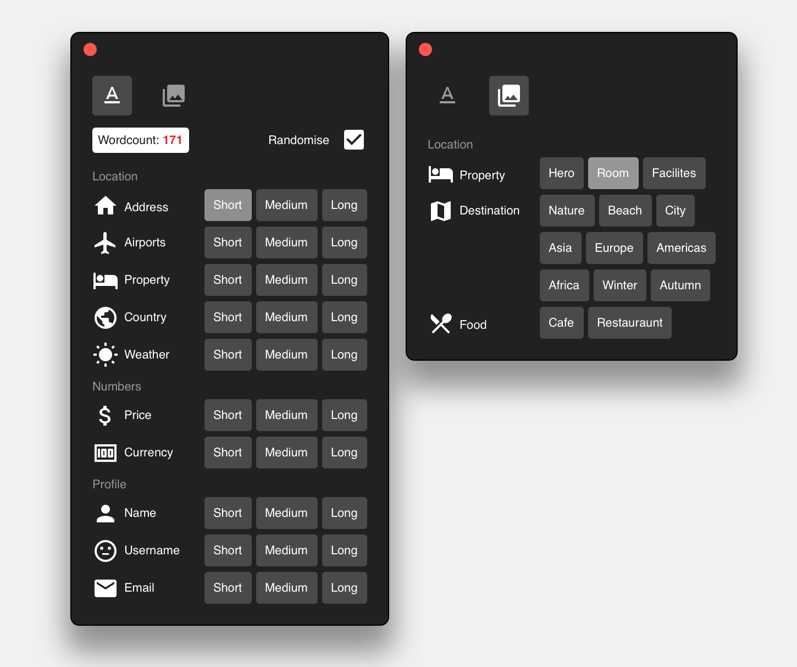

# Agoda Toolkit 2.2

Quickly generate real content for your design workflow
👍[Download here](https://github.com/agoda-com/agoda-design-toolkit/releases/latest/download/Agoda-Design-Toolkit.sketchplugin.zip)

👍[Download here](https://github.com/agoda-com/agoda-design-toolkit/releases/latest/download/Agoda-Design-Toolkit.sketchplugin.zip)

#### Current features
- Strings: `Short`, `Medium`, `Long`
- Images 
- Word count
- Randomise 
- Translation
- Crossout
- Data Supplier

#### Current datasets

| String | Images |
| ---- | ----------------- |
| Address |  Hero |     
| Airport |  Facilities |              
| City |     Rooms |     
| Country | Tinyfaces |
| Currency |
| Dates |
| Names |
| Phone Number
| Property Name
| Timestamp 
| Weather

#### Future updates
- [X] UI redesign
- [X] Sketch Runner integration 
- [X] Toast notification
- [X] tinyface.es support
- [ ] Sketch plugin update
- [ ] Custom entry for strings & images

Dataset | Short | Medium | Long
| ----- | ----- | ------ | ---- 
| Usernames | 4-7 | 8-11 | 12-22 
| Email addresses | 15-17 | 18-21 | 22-33 |
| Hotel amenities | 3-8 | 9-16 | 17-39
| Hotel room names | 6-14 | 15-26 | 27-49
